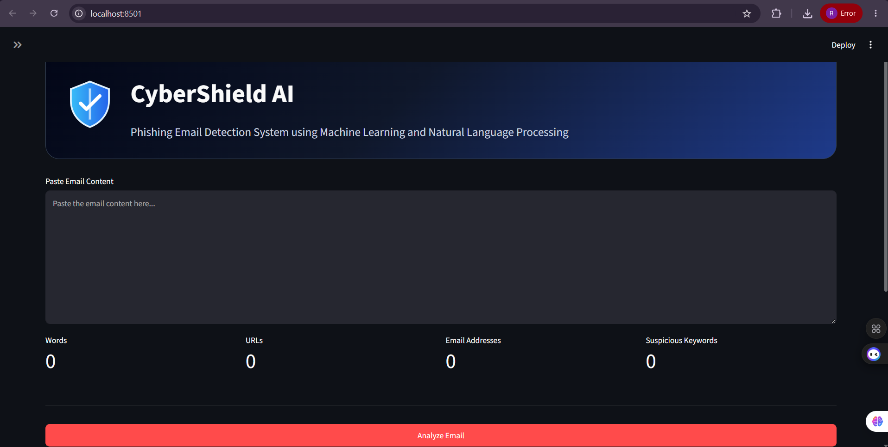
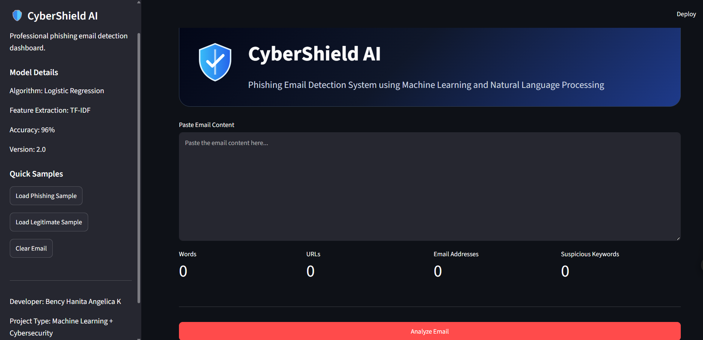
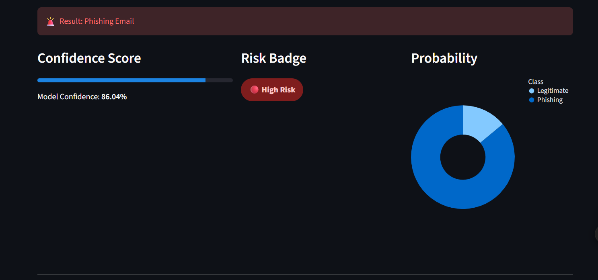
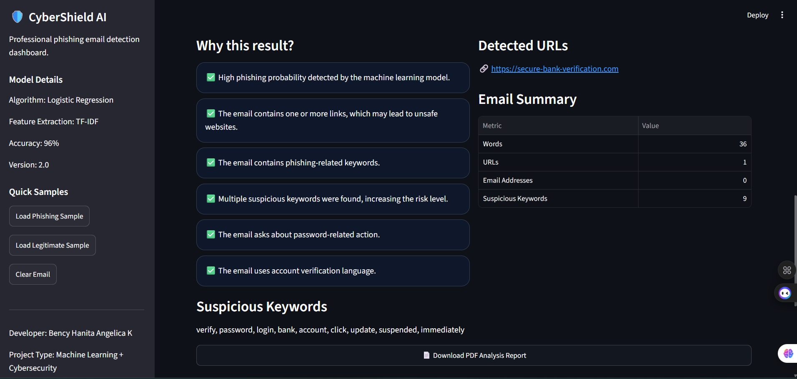
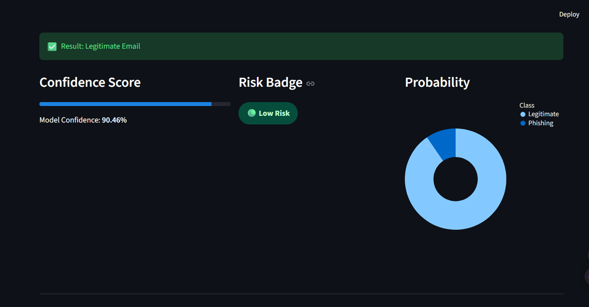
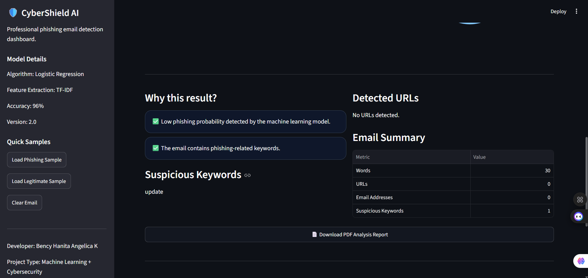
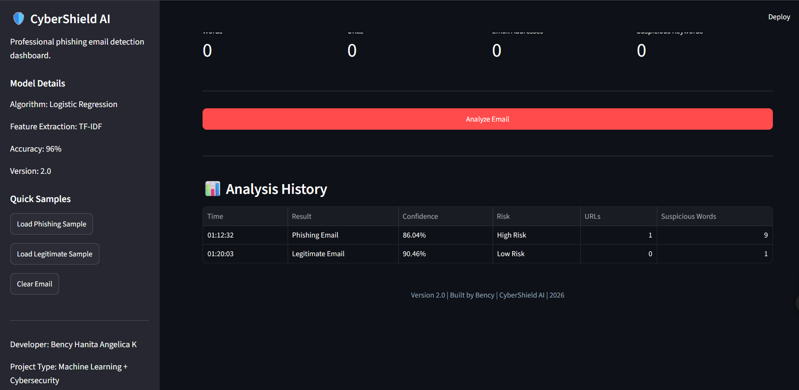

# 🛡️ CyberShield AI - Phishing Email Detection System

A professional Machine Learning web application that detects whether an email is **Phishing** or **Legitimate** using **Natural Language Processing (NLP)** and **Logistic Regression**.

---

# 🚀 Features

- Machine Learning based phishing detection
- Professional CyberShield AI dashboard
- Confidence score
- Risk Badge (Low / Medium / High)
- Probability chart
- URL Detection
- Suspicious Keyword Detection
- Email Summary
- Analysis History
- PDF Report Download
- Sample Emails
- Responsive Streamlit UI

---

# 🛠️ Tech Stack

- Python
- Streamlit
- Scikit-learn
- Pandas
- TF-IDF Vectorizer
- Logistic Regression
- Joblib
- ReportLab
- Altair

---

# 📂 Project Structure

```text
phishing-email-detection
│
├── app.py
├── train_model.py
├── phishing_email.csv
├── requirements.txt
├── README.md
├── .gitignore
│
├── model
│   ├── model.pkl
│   └── vectorizer.pkl
│
└── screenshots
```

---

# 📸 Screenshots

## 🏠 Home Page



---

## 📋 Sidebar



---

## 🚨 Phishing Detection

### Part 1



### Part 2



---

## ✅ Legitimate Detection

### Part 1



### Part 2



---

## 📊 Analysis History



---

# ⚙️ Installation

```bash
git clone https://github.com/Bency-Hanita-Angelica-K/cybershield-ai-phishing-email-detection.git

cd cybershield-ai-phishing-email-detection

python -m venv venv

venv\Scripts\activate

pip install -r requirements.txt

python train_model.py

streamlit run app.py
```

---

# 📊 Machine Learning Model

- TF-IDF Vectorizer
- Logistic Regression
- Accuracy: **96%**

---

# 👩‍💻 Developer

**Bency Hanita Angelica K**

---

# ⭐ If you like this project, don't forget to star the repository.
